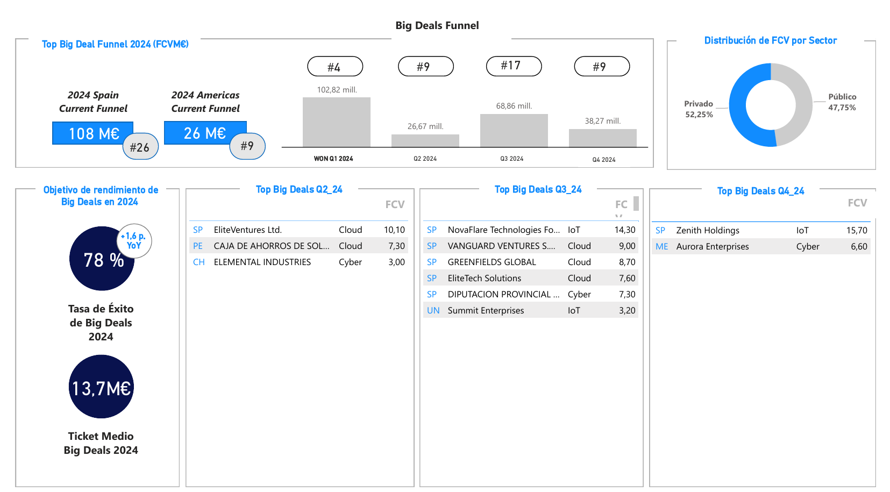

# Customer Intelligence - Big Deals Dashboard 🟦

## Project Overview 🧭
This project focuses on building a real-time **Big Deals** dashboard using Power BI. The goal is to visualize and analyze sales opportunities with significant contract values (Full Contract Value, FCV) across different stages of the sales funnel, with a special focus on geographical regions and sectors (public vs. private). The data is normalized to track these opportunities, and a threshold for defining "Big Deals" varies based on the region.

## Key Objectives
- **Real-time Visualization**: Display KPIs and metrics for "Big Deals" in the sales funnel.
- **Sales Funnel Analysis**: Track opportunities in stages F2 to F5.
- **Geographical and Sector Insights**: Understand Big Deal distribution by region (Americas, Spain) and sector (Public vs. Private).
  
## KPIs and Metrics
1. **2024 Spain Current Funnel**:
   - Total Value (M€): Sum of FCV for opportunities in stages F2 - F5.
   - Number of Opportunities (#): Count of opportunities in stages F2 - F5.

2. **2024 Big Deals Performance**:
   - **Success Rate 2024 (%)**: Proportion of FCV won over the total FCV (won, lost, or canceled).
   - **Year-over-Year Success Rate Growth**: Percentage change in success rate from 2023 to 2024.
   - **Average Ticket Size 2024 (M€)**: Total FCV divided by the number of Big Deals in 2024.

3. **Quarterly Analysis**:
   - Analyze opportunity values and counts for Q1, Q2, Q3, and Q4 of 2024.

4. **Sector Analysis**:
   - Value of opportunities in public and private sectors for stages F2 - F5.
   - Proportion of opportunities in the public vs. private sector.

## Features
- **Big Deals Thresholds**: A dynamic threshold for each region determines which opportunities qualify as "Big Deals."
- **Time-Based Visualizations**: Trends and insights into Big Deals over time.
- **Geographic Segmentation**: Specific breakdowns for Spain and the Americas (Chile, Peru, Mexico, Colombia, Brazil, and the United States).

## Tools & Technologies 
- **Power BI**: Main tool used for building the dashboard and performing data visualizations.
- **DAX**: For calculations and KPIs within Power BI.
- **Data Sources**: Raw sales and opportunity data | **Data is Private for this project**
